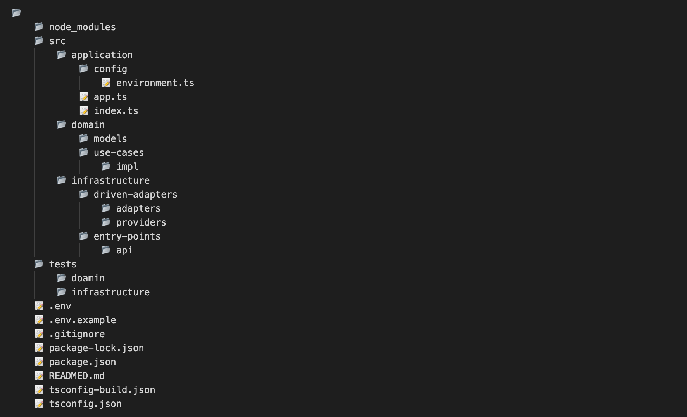
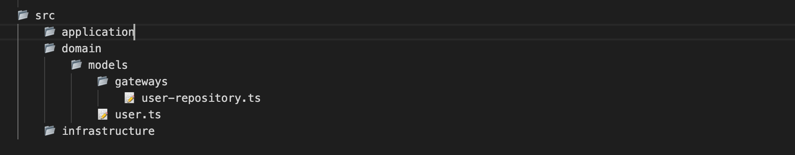
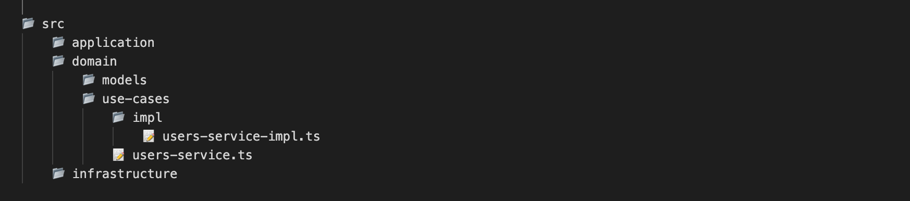
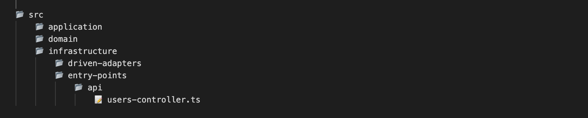
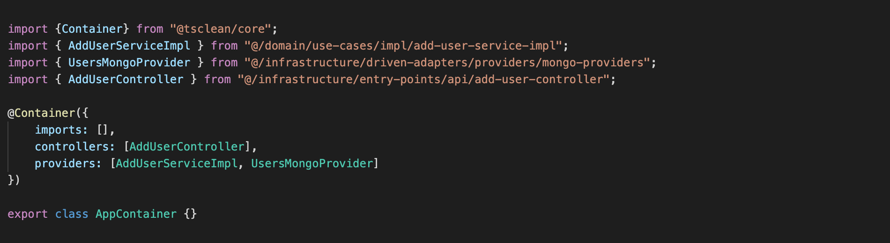
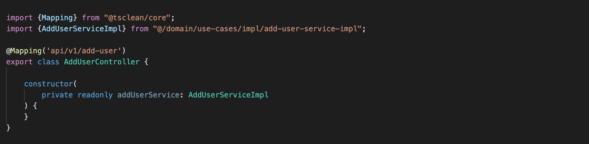

# Clean Architecture Scaffold

This CLI creates the structure of a NodeJs and TypeScript project based on clean architecture to build REST full APIs, it comes with the initial configuration of an Express application as a NodeJs framework and this is located in the **`application layer`**.

- [Clean Architecture Scaffold](#clean-architecture-scaffold)
- [Implementation of the plugin](#Implementation-of-the-plugin)
- [Tasks](#tasks)
  - [Project Generation](#project-generation)
  - [Model Generation](#model-generation)
  - [Interface Generation](#interface-generation)
  - [Service Generation](#service-generation)
  - [Adapter ORM Generation](#adapter-orm-generation)
  - [Controller Generate](#controller-generation)
  

# Implementation of the plugin

We install the plugin globally in our computer, to be able to access the commands that generate the tasks.
the tasks.

```shell
    npm i -g @tsclean/scaffold
```
   
# Tasks

## Project Generation

1. We generate the project structure with the command **`scaffold create:project`**, which receives one parameter **`--name`**.

```shell
   scaffold create:project --name=[project name]
```

```shell
   cd project name
```

**_Plugin generated structure:_**



## Model Generation

1. The **`scaffold create:entity`** command will generate a model in the **`domain layer [models]`**, this task has **`--name`** as parameter and this is required.
   The name must have a middle hyphen in case it is compound.

   Example: **`--name=user, --name=user-detail, --name=post-comments-user.`**

```shell
   scaffold create:entity --name=[model name]
```

**_Task generating structure:_**



## Interface Generation

1. The **`scaffold create:interface`** command generates an interface, the location of the file is according to the
   component where it is required. where it is required. The name must have a hyphen in case it is a compound name.


   Example: **`--name=user, --name=user-detail, --name=post-comments-user.`**

```shell
   scaffold create:interface --name=user-detail --path=model
```

```shell
   scaffold create:interface --name=user-detail --path=service
```

```shell
   scaffold create:interface --name=user-detail --path=infra
```


## Service Generation

1. The **`scaffold create:service`** command will generate the interface and the service that implements it in the **`domain layer [use-cases]`**.
   **`domain layer [use-cases]`**, this task has **`--name`** as parameter and this is required. The name must have a hyphen in case it is a compound name.

   Example: **`--name=user, --name=user-detail, --name=post-comments-user.`**

```shell
   scaffold create:service --name=[service name]
```

**_Structure that generates the task:_**



**`This configuration must be done manually.`**

## Adapter ORM Generation

1. The **`scaffold create:adapter-orm`** command will generate an adapter in the **`infrastructure layer`**, 
   this task has **`--name`** and **`--orm`** as parameters this is required. The name of the **`--manager`** parameter corresponds to the database manager.
   After the adapter is generated, the provider must be included in the app.ts file and then the name of the provider in the corresponding service must be passed through the constructor.


   Example: **`--name=user --orm=sequelize --manager=mysql`**


2. By convention the plugin handles names in singular, this helps to create additional code that benefits each component. 
   In this case when you create the adapter with the name that matches the entity in the domain models folder, it does the automatic import in all the component of the adapter.


   Example: **`[domain/models/user.ts] --name=user \\ [domain/models/post.ts] --name=post`**


```shell
   scaffold create:adapter --name=[adapter name] --orm=[orm name] --manager=[database manager]
```

**_Structure that generates the task:_**

2. This command generates two files, the class that communicates with the service through the gateway and the provider resolves the dependencies of this communication.

**`This configuration must be done manually.`**

    Service configuration.


    app.ts configuration.


## Controller Generation

1. The **`scaffold create:controller`** command will generate a controller in the **`infrastructure layer`**,
   this task has **`--name`** as parameter and this is required. The name must have a hyphen in case it is a compound name.

   Example: **`--name=user, --name=user-detail, --name=post-comments-user.`**

```shell
   scaffold create:controller --name=[controller name]
```

**_Structure that generates the task:_**



**`This configuration must be done manually.`**

app.ts configuration.



2. The naming convention must be applied between the service and the controller to generate the Dependency Injection in the controller and an endpoint to enter the application.



3. After all the configuration you must create a method and put the corresponding decorator, the decorator maps the HTTP verb.

HTTP verbs  => Decorators

GET         => @Get()

POST        => @Post()

PUT         => @Put()

DELETE      => @Delete()


